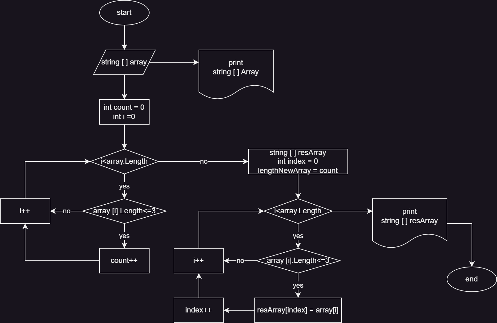
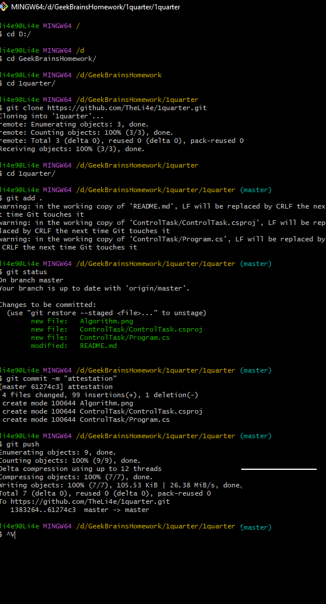

# Итоговая контрольная работа по основному блоку
## Задания для успешной сдачи работы:
### Создать репозиторий на GitHub

`https://github.com/TheLi4e/1quarter.git`

### Нарисовать блок-схему алгоритма

### Снабдить репозиторий оформленным текстовым описанием решения

*Задача:* Написать программу, которая из имеющегося массива строк формирует новый массив из строк, длина которых меньше, либо равна 3 символам. Первоначальный массив можно ввести с клавиатуры, либо задать на старте выполнения алгоритма. При решении не рекомендуется пользоваться коллекциями, лучше обойтись исключительно массивами.

*Примеры*

`[“Hello”, “2”, “world”, “:-)”] → [“2”, “:-)”]`

`[“1234”, “1567”, “-2”, “computer science”] → [“-2”]`

`[“Russia”, “Denmark”, “Kazan”] → [ ]`

### Решение
1. Для начала создаем массив string[ ] array.

2. Метод PrintArray выводит на экран заданный массив.

3. Метод ArrLength нужен, чтобы определить размер нового массива (цикл, перебирает все элементы заданного массива string[ ] array, а счетчик count подсчитывает сколько элементов меньше либо равны 3 символам).

4. Метод NewArray создает новый массив, с размером который получим из метода ArrLength. Метод принимает заданный в начале алгоритма массив string[ ] array, проходится циклом по этому массиву и элементами с длинной меньше либо равной 3 символам заполняет новый массив string[ ] result.

5. С помощью повторного обращения к методу PrintArray новый массив string[ ] result выводится на экран.

### Написать программу, решающую поставленную задачу
Программа находится в папке ControlTask

### Использовать контроль версий в работе над этим небольшим проектом
